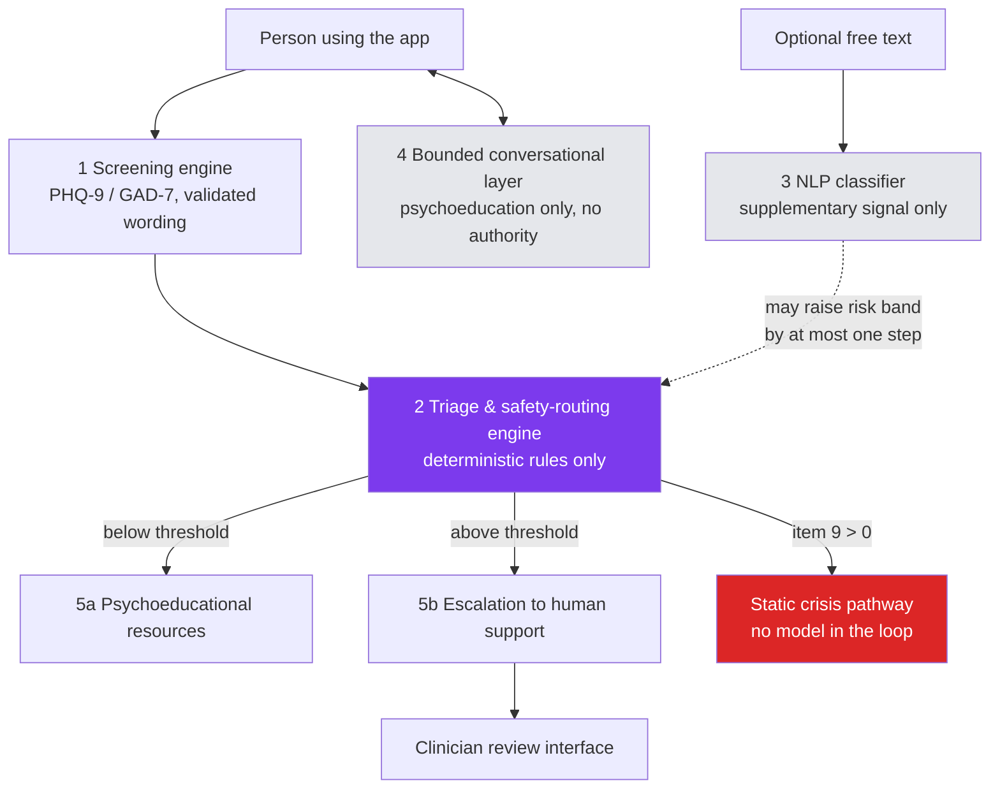

# Mira

Mira is a screening and decision-support tool for depression and anxiety symptoms. It is
**not diagnostic, not therapeutic, and not a crisis service** — it exists to help someone
understand their symptoms and get routed to the right kind of help, nothing more.

> **Disclaimer**: Mira does not diagnose any condition, does not replace a clinician, and is
> not equipped to handle a crisis on its own. If you or someone you know is in immediate
> danger, contact local emergency services or a crisis line in your country right away.

## What it is

A privacy-preserving, mobile-first web application that administers PHQ-9 and GAD-7 — the
standard validated screening instruments for depression and anxiety — computes a risk level
through deterministic rules, and routes the person either to psychoeducational resources or to
human support. It is built for a Nigerian low-resource context: cheap Android devices,
expensive and unreliable mobile data, and a well-documented reluctance to disclose mental
health difficulty.

It is the reference implementation for an MSc research project at the University of Lagos,
released as open source so the design and safety reasoning behind it can be inspected, not
just the thesis text.

## Architecture

Five components, in strict order of authority — nothing downstream of component 1 can ever
override a clinical decision made upstream of it.



The triage engine (component 2) is deterministic rule code — no model output, from the
classifier or the LLM, can ever decide, lower, or override a risk band. See
[docs/architecture.md](docs/architecture.md) for the full layered view and
[docs/decisions/0001-rule-based-triage.md](docs/decisions/0001-rule-based-triage.md) for why.

## Quick start

No Docker anywhere — everything here runs natively, orchestrated through npm scripts.

**Prerequisites**: Node (see [.nvmrc](.nvmrc)), npm, Python 3.10+ (for
[services/classifier/](services/classifier/)), and a reachable Postgres database. See
[docs/local-setup.md](docs/local-setup.md) for three ways to get Postgres running (a native
install, a hosted free tier, or — as a documented, unimplemented last resort — what SQLite would
cost you). No local Postgres and don't want to set one up yet? `npm run db:local` starts an
in-process, Postgres-compatible database (via [PGlite](https://pglite.dev)) instead — see the
comment at the top of [`scripts/dev-db.ts`](scripts/dev-db.ts) for the two ways it behaves
differently from real Postgres (`prisma migrate dev` and prepared statements).

```bash
npm install
npm run setup                # checks prerequisites, bootstraps .env, migrates, seeds, and
                              # creates services/classifier/'s virtual environment
npm run dev:all               # Nuxt app + classifier service together
```

If the database becomes unreachable later, the app fails to boot with a clear message naming
`DATABASE_URL` rather than a raw connection error — see
`server/plugins/verify-database-reachable.ts`.

### The four npm scripts

- **`npm run setup`** — checks Node (against [.nvmrc](.nvmrc)), npm, Python 3.10+, and that
  `DATABASE_URL` is reachable, failing with a specific, actionable message per missing
  prerequisite and installing nothing itself at that stage. Once every check passes, it creates
  `.env` from `.env.example` if one doesn't exist yet (generating random development values for
  `ENCRYPTION_KEY`, `IDENTIFIER_HASH_PEPPER`, and `AUTH_SECRET` so the app can boot), runs
  `prisma migrate deploy`, runs the base seed (`npm run db:seed`), and creates
  `services/classifier/`'s virtual environment with its dependencies installed. Safe to re-run —
  it never touches an existing `.env` or virtual environment.
- **`npm run classifier`** — starts the classifier service by invoking its virtual environment's
  own Python interpreter directly (no shell "activate" step), so it works the same way on
  Windows and Unix. Assumes `npm run setup` has already created the venv.
- **`npm run dev:all`** — runs the Nuxt dev server and the classifier service together via
  `concurrently`, with colour-coded `nuxt`/`classifier` log prefixes.
- **`npm run demo`** — resets the database, seeds six deterministic synthetic walkthrough
  scenarios (`prisma/demo-seed.ts`: minimal/moderate/high/crisis-risk sessions, an already-reviewed
  escalation, and a user with a multi-session history), then starts `dev:all`. This is the single
  command to run before an examiner or usability-test walkthrough.

## Running tests

```bash
npm run lint                # ESLint
npm run typecheck           # nuxi typecheck
npm test                    # Vitest — unit + integration
npm run test:coverage       # Vitest with coverage thresholds (server/domain, server/utils)
npm run test:e2e            # Playwright, mobile viewport by default
```

## Swapping in a trained classifier

By default `server/services/classifier/` talks to a mock implementation so the app runs with
no model present (see rule R7 — screening must degrade gracefully, never fail, when the
classifier is unreachable). To use a trained model:

1. Implement the contract described in
   [services/classifier/README.md](services/classifier/README.md).
2. Point `CLASSIFIER_SERVICE_URL` (see [.env.example](.env.example)) at your running instance,
   and set `CLASSIFIER_MODE="http"`.
3. Run it with `npm run classifier` (or `npm run dev:all` to run it alongside the Nuxt app).

## Deployment

A plain Node deployment — no container required, though one can be added later without changing
any application code, since the build output below is already a self-contained Node server:

```bash
npm run build                          # produces .output/
node .output/server/index.mjs          # runs the built server
```

Required environment variables are the same ones in [.env.example](.env.example) — in
particular `DATABASE_URL`, `ENCRYPTION_KEY`, `IDENTIFIER_HASH_PEPPER`, and `AUTH_SECRET` must be
set to real, non-development values (never the ones `npm run setup` generates for local
development), and `NODE_ENV="production"`. Run `npx prisma migrate deploy` against the production
database before starting the server for the first time.

## Research provenance and citation

Mira is the reference implementation accompanying an MSc dissertation at the University of
Lagos on privacy-preserving mental health screening for low-resource settings. The thesis
itself is not part of this repository (see rule R10). If you use this code in academic work,
please cite the dissertation rather than this repository directly; citation details will be
added here once the work is published.

## Contributing

See [CONTRIBUTING.md](CONTRIBUTING.md) — in particular the section on changes to
safety-critical code, which requires clinical review before merge.

## Security

See [SECURITY.md](SECURITY.md) for the private disclosure route.

## License

[MIT](LICENSE).
