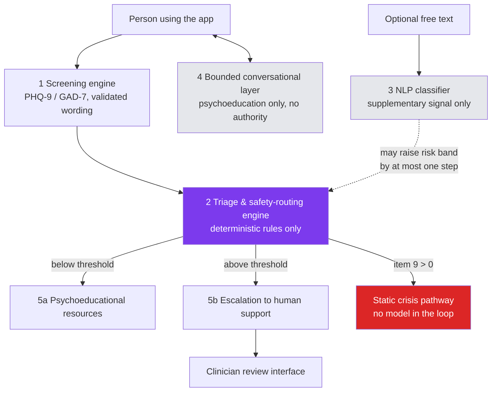

# Mira

Mira is a screening and decision-support tool for depression and anxiety symptoms. It is
**not diagnostic, not therapeutic, and not a crisis service** — it exists to help someone
understand their symptoms and get routed to the right kind of help, nothing more.

> **Disclaimer**: Mira does not diagnose any condition, does not replace a clinician, and is
> not equipped to handle a crisis on its own. If you or someone you know is in immediate
> danger, contact local emergency services or a crisis line in your country right away.

## What it is

A privacy-preserving, mobile-first web application that administers PHQ-9 and GAD-7 — the
standard validated screening instruments for depression and anxiety — computes a risk level
through deterministic rules, and routes the person either to psychoeducational resources or to
human support. It is built for a Nigerian low-resource context: cheap Android devices,
expensive and unreliable mobile data, and a well-documented reluctance to disclose mental
health difficulty.

It is the reference implementation for an MSc research project at the University of Lagos,
released as open source so the design and safety reasoning behind it can be inspected, not
just the thesis text.

## Architecture

Five components, in strict order of authority — nothing downstream of component 1 can ever
override a clinical decision made upstream of it.



The triage engine (component 2) is deterministic rule code — no model output, from the
classifier or the LLM, can ever decide, lower, or override a risk band. See
[docs/architecture.md](docs/architecture.md) for the full layered view and
[docs/decisions/0001-rule-based-triage.md](docs/decisions/0001-rule-based-triage.md) for why.

## Quick start

Requirements: Node (see [.nvmrc](.nvmrc)) and npm. Postgres is needed too — either via Docker,
or without it (see below).

```bash
npm install
cp .env.example .env        # fill in local values; never commit .env
npm run dev                 # Nuxt app at http://localhost:3000
```

### Postgres, with or without Docker

With Docker: `docker compose up -d db`, then `npx prisma migrate deploy && npm run db:seed`.

Without Docker: `npm run db:local` starts an in-process, Postgres-compatible database (via
[PGlite](https://pglite.dev)) in your terminal — leave it running and, in another terminal, run
`npx prisma migrate deploy && npm run db:seed` against the URL it prints. See the comment at the
top of [`scripts/dev-db.ts`](scripts/dev-db.ts) for the two ways it behaves differently from
real Postgres (`prisma migrate dev` and prepared statements).

## Running tests

```bash
npm run lint                # ESLint
npm run typecheck           # nuxi typecheck
npm test                    # Vitest — unit + integration
npm run test:coverage       # Vitest with coverage thresholds (server/domain, server/utils)
npm run test:e2e            # Playwright, mobile viewport by default
```

## Swapping in a trained classifier

By default `server/services/classifier/` talks to a mock implementation so the app runs with
no model present (see rule R7 — screening must degrade gracefully, never fail, when the
classifier is unreachable). To use a trained model:

1. Implement the contract described in
   [services/classifier/README.md](services/classifier/README.md).
2. Point `CLASSIFIER_SERVICE_URL` (see [.env.example](.env.example)) at your running instance.
3. Run `services/classifier/` via its own `Dockerfile`, or `docker compose up classifier`.

## Research provenance and citation

Mira is the reference implementation accompanying an MSc dissertation at the University of
Lagos on privacy-preserving mental health screening for low-resource settings. The thesis
itself is not part of this repository (see rule R10). If you use this code in academic work,
please cite the dissertation rather than this repository directly; citation details will be
added here once the work is published.

## Contributing

See [CONTRIBUTING.md](CONTRIBUTING.md) — in particular the section on changes to
safety-critical code, which requires clinical review before merge.

## Security

See [SECURITY.md](SECURITY.md) for the private disclosure route.

## License

[MIT](LICENSE).
