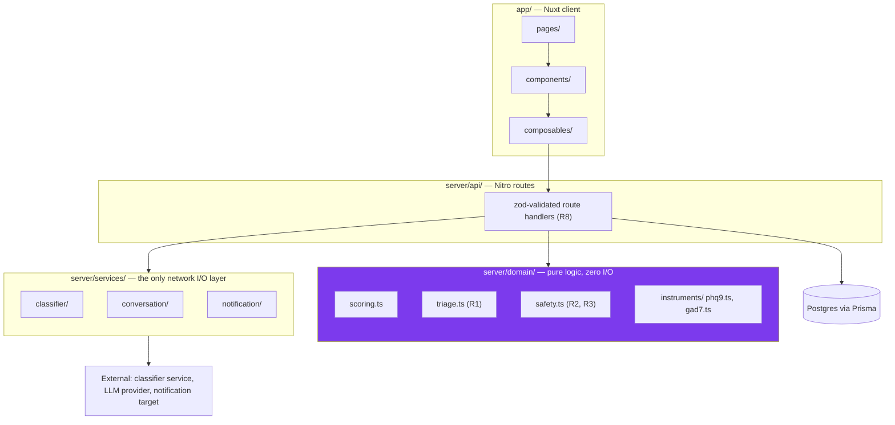
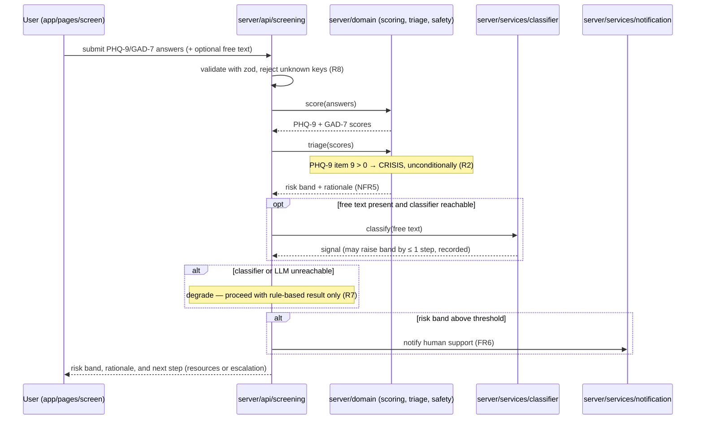

# Architecture

Mira is organized as five components with a strict authority order (see [CLAUDE.md](../CLAUDE.md)):
a lower-numbered component's output can never be overridden by a higher-numbered one. This
document describes the layering that enforces that order in code, not just in policy.

## Layered view

**Why domain is isolated.** `server/domain/` contains only pure functions and types — no Nuxt,
Nitro, Prisma, or service imports. That constraint is what makes `triage.ts` and `safety.ts`
unit-testable in complete isolation and auditable by someone who has never run the app. A
reviewer can read `triage.ts` top to bottom and know exactly what determines a risk band,
without tracing through HTTP handlers or a database client.

**Why services is the only I/O layer.** Everything that can fail, time out, or return
unpredictable output — the classifier, the LLM, notification delivery — is confined to
`server/services/`. Route handlers in `server/api/` call into services and domain, but the
domain layer never calls a service directly. This is what makes rule R7 (screening must
complete when the classifier and LLM are unreachable) enforceable: the code path that computes
a risk band simply has no dependency that can be "unreachable."

## Request flow: a screening submission

The classifier is explicitly a side input to triage, never a replacement for it: it can only
raise a band by at most one step, and doing so is recorded (rule R1).

## Data model summary

Full detail lives in [data-model.md](data-model.md); schema source of truth is
[`prisma/schema.prisma`](../prisma/schema.prisma). At a glance:

- A screening session belongs to either a registered account or an anonymous identifier — never
  requires the former (rule R9).
- Free-text answers and clinician notes are encrypted at rest with AES-256-GCM (rule R5);
  emails are stored as keyed hashes, never plaintext.
- Triage results store the rule outcome and, separately, whether the classifier raised the band
  and by how much — so the two are always distinguishable in review.

## Deployment shape

Three deployable units, matching `docker-compose.yml`:

1. **Nuxt app** (`app/`, `server/`) — the web app and its API.
2. **Classifier service** (`services/classifier/`) — a separately deployable Python FastAPI
   service behind the contract in `services/classifier/README.md`. The Nuxt app runs fully
   without it (rule R7); it's an optional enhancement, not a dependency.
3. **Postgres** — via Prisma.

## Where a requirement lives

See [`docs/traceability-matrix.md`](traceability-matrix.md) (generated by
`scripts/generate-traceability.ts` from `// [FR#]` / `// [NFR#]` tags — never hand-edited) for
the authoritative, up-to-date mapping. The component list in CLAUDE.md gives the high-level
version.

## Related decisions

- [0001 — Why triage is rule-based rather than model-driven](decisions/0001-rule-based-triage.md)
