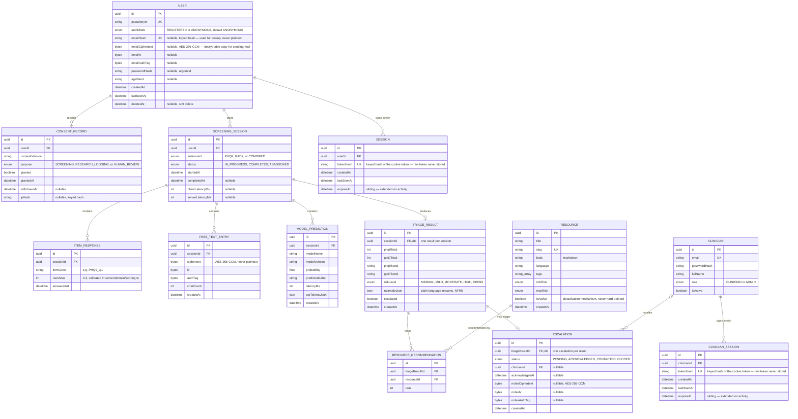

# Data model

The single source of truth for persisted shapes is [`prisma/schema.prisma`](../prisma/schema.prisma).
This document explains the _why_ behind that schema; if the two ever disagree, the schema is
correct and this file is stale — please fix it.

## Entity-relationship diagram

`AuditLog` is intentionally left off the diagram above: it references actors and entities by
`(type, id)` pairs rather than foreign keys, because an actor can be a `User`, a `Clinician`,
or the system itself, and Prisma/Postgres foreign keys can't express that polymorphism
directly. See [Audit trail](#audit-trail) below.

## Entities

### User (FR1, rule R9)

A person using the app. `authMode` defaults to `ANONYMOUS` because anonymous use is a
first-class path, not a fallback — nothing in the screening flow requires `emailHash` or
`passwordHash` to be set. `pseudonym` is the only identifier ever shown back to the person or
surfaced to a clinician; a real email is never stored in queryable form — `emailHash` (a keyed
HMAC-SHA256 hash, see `server/utils/privacy.ts`) is what login/registration actually look up
by, and `emailCiphertext`/`emailIv`/`emailAuthTag` hold an AES-256-GCM encrypted copy that can
be decrypted server-side only when the app genuinely needs to send that person mail — the
database itself still can't be queried by email, and a leaked hash alone can't be reversed to
recover it. `passwordHash` is argon2id, never a faster/weaker general-purpose hash.
`deletedAt` exists for soft-delete bookkeeping in normal operation, but the actual
data-subject deletion flow (prompt 16) performs a real, cascading hard delete — `deletedAt` is
not a substitute for that.

### Session (FR1)

A server-side record backing one httpOnly session cookie. `tokenHash` — a keyed hash of the
raw cookie value — is the only thing stored; the raw token itself lives only in the user's
browser, so a database read (or leak) alone can never be replayed as a valid session. Deleting
a `User` cascades to their `Session` rows, so account deletion also invalidates every active
login. `expiresAt` implements sliding expiry: `server/middleware/auth.ts` extends it (and
re-issues the cookie) on activity, so an active user is never logged out mid-use, while an
abandoned session still expires.

### ConsentRecord (NFR1)

One row per consent decision, not a single mutable flag. `granted` plus `withdrawnAt` lets the
system reconstruct what a person had and hadn't consented to at any point in time, which is
what a Nigeria Data Protection Act 2023 accountability review needs to see. `purpose` separates
consent to be screened at all, consent to have (research-only) interaction data logged, and
consent to have an escalate-worthy result reviewed by a human clinician (`HUMAN_REVIEW`) — all
three default to off everywhere they're asked, per CLAUDE.md.

`HUMAN_REVIEW` is the consent-aware branch FR6 requires, made explicit here and in
`server/domain/consent.ts`: an escalate-worthy `TriageResult` (`escalated = true`) does **not**
by itself create an `Escalation` row. `server/api/screening/[id]/complete.post.ts` checks for an
_active_ `HUMAN_REVIEW` grant (`canCreateEscalationRecord`) before creating one; without it, the
person still sees the referral screen and helplines (`app/components/safety/ReferralScreen.vue`)
— every escalate-worthy result gets that, unconditionally — but no row is created, so nothing
identifiable enters the clinician queue. The same screen offers an explicit "share this with a
clinician" action (`server/api/screening/[id]/escalate.post.ts`) that grants `HUMAN_REVIEW`
consent and creates the row together, as informed consent given _after_ the person has already
seen their result. A later withdrawal of `HUMAN_REVIEW` does not delete an already-created
`Escalation` row (the case history is a fact about what happened), but it does immediately stop
a clinician's detail view from showing that person's free text — `canRevealFreeTextToClinician`
re-checks the _current_ grant on every read, independently of whether the row itself exists.

### ScreeningSession (FR2)

One administration of PHQ-9 and/or GAD-7. Owns everything produced during that administration:
its `ItemResponse` rows, an optional `FreeTextEntry`, any `ModelPrediction` calls, and — once
`status` reaches `COMPLETED` — exactly one `TriageResult`. `clientLatencyMs` and
`serverLatencyMs` exist specifically to back NFR3 (defined, measured latency); they are
populated by the API layer in a later prompt, not computed here.

### ItemResponse (FR2)

One answered instrument item. The unique constraint on `(sessionId, itemCode)` is what makes
answer submission idempotent: the API can `upsert` on that pair, so a request retried after a
dropped connection on a poor mobile network overwrites the same row instead of creating a
duplicate. `rawValue`'s 0–3 range is enforced in `server/domain/scoring.ts`'s pure scoring
functions, not as a database check constraint — see that file's tests once it exists.

### FreeTextEntry (FR3, rule R5)

An optional free-text answer. This table only ever holds `ciphertext`, `iv`, and `authTag` —
opaque AES-256-GCM output. Plaintext is never written here; the encryption happens
application-side before a query is issued, so a database dump or backup is never a
confidentiality risk for this field on its own.

### ModelPrediction (FR3, rule R1)

One classifier call's result, kept as a factual record of what the classifier returned and
when. It is deliberately _not_ a foreign key input to how `TriageResult.riskLevel` gets
computed — `server/domain/triage.ts` treats it as a side signal it may consult, per the
one-step-raise-only rule in [ADR 0001](decisions/0001-rule-based-triage.md), never as the
value that sets a band.

### TriageResult (FR4, rule R1, NFR5)

The one deterministic outcome of a session, enforced at the schema level by the `@unique` on
`sessionId`. `rationaleJson` holds the plain-language reasons a person or clinician can read —
this is what makes NFR5 (interpretable rationale) a stored fact, not just a UI convention.
`escalated` is a denormalized copy of the routing decision so it can be indexed and queried
directly without joining out to `Escalation`.

### Resource (FR5) and ResourceRecommendation (FR5)

`Resource` rows are content; `ResourceRecommendation` rows are the ranked link from one
`TriageResult` to the resources shown for it. Resources are never hard-deleted once they've
been recommended to someone — `isActive` is the only deactivation mechanism — because deleting
one would either orphan or falsify historical `ResourceRecommendation` rows for sessions that
already happened. The foreign key from `ResourceRecommendation` to `Resource` uses
`onDelete: Restrict` to make that guarantee a database-level fact, not just a convention.

### Escalation (FR6, FR7)

Created only when a `TriageResult` crosses the escalation threshold _and_ `HUMAN_REVIEW`
consent is active — see the `ConsentRecord` section above for the full consent-aware branch.
`clinicianId` is nullable and, if a clinician account is later removed, is set to `null` rather
than cascading the deletion — the case history has to survive staff turnover.
`notesCiphertext`/`notesIv`/`notesAuthTag` follow the same encrypt-before-you-query discipline
as `FreeTextEntry`'s three columns (`server/utils/crypto.ts`'s `encryptField`/`decryptField`),
written by `server/api/clinician/escalations/[id].patch.ts`.

### Clinician (FR7)

A deliberately separate account type from `User` — see [CONTRIBUTING.md](../CONTRIBUTING.md#the-clinician-auth-realm)
on why the clinician auth realm and the person-being-screened auth realm never share a table, a
session type, or a login page. Unlike `User.emailHash`, `Clinician.email` is stored in the
clear: clinicians are staff, not the vulnerable population NFR1's protections are built around,
and they need to be contactable by that address.

### ClinicianSession (FR7)

The clinician-realm counterpart to `Session` — same shape, same sliding-expiry discipline
(`server/middleware/clinician-auth.ts`), but its own table, backing its own
`mira_clinician_session` cookie, so it can never be confused with a person-being-screened
session even in the same browser.

### Audit trail

`AuditLog` records `actorType` + `actorId` and `entityType` + `entityId` as plain strings
rather than foreign keys, because an actor can be a `User`, a `Clinician`, or the system
itself — a relation can't express that union across two unrelated tables. `metadataJson` must
never carry PHI or free text; there's no redactor sitting between this table and the code that
writes to it the way there is for `server/utils/logger.ts` (rule R4), so that discipline is
enforced by code review on anything that writes an `AuditLog` row, not by the schema.

## Deletion and retention

Deleting a `User` cascades all the way down through `ScreeningSession` → `ItemResponse` /
`FreeTextEntry` / `ModelPrediction` / `TriageResult` → `ResourceRecommendation` /
`Escalation`. That full chain is a database-level `ON DELETE CASCADE`, not application logic,
specifically so the data-subject deletion flow (prompt 16, `server/utils/dsar.ts`) can delete a
`User` row and trust that nothing referencing it survives — verifiable by a direct query
against every table, not just the ones the deletion code remembered to touch.

## Migrations

The initial migration lives at
[`prisma/migrations/20260821000000_init/`](../prisma/migrations/20260821000000_init/). It was
generated offline with `prisma migrate diff --from-empty --to-schema-datamodel` because no
Postgres instance was reachable in the environment that authored it — run `docker compose up -d
db` followed by `npx prisma migrate dev` against a real database before trusting this migration
in any environment that matters, and let `prisma migrate dev` take over authoring migrations
from this point on.
